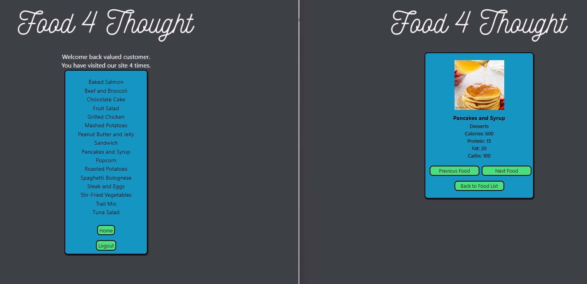

# Food-4-Thought

## Description

"Welcome to our food website! We are dedicated to providing you with the most delicious and nutritious food options. Our inventory is carefully curated to include only the best and healthiest foods. To make it easier for you to make informed choices, we've included detailed nutritional information for every item in our inventory. Whether you're counting calories, watching your sodium intake, or following a specific diet, our nutritional information makes it simple to find the foods that are right for you. So, take a look around, find your favorite dishes, and enjoy a healthier and tastier life with us!"

## Installation

For installation, everything has to get done in your terminal. First, we have to "npm i" which will install all the required NPM packages, next you have to login into MySql using "MySQL -u root -p" and SOURCE the database using "SOURCE db/schema.sql;". Then create your ".env file" and run "npm run seed" to put a fake database. Lastly, quit MySQL and run "npm run start" to see it online after that you should be able to visit the localhost.

## Mock-Up

The following image shows the our web application's appearance and functionality:

## Usage

To use Food-4-Thought, Open the page link [F4T](https://f4t-db.herokuapp.com/), First, you must log in or Sign Up to view the market for our website. you can click on the several interactive buttons on the page where you can select food options and be presented with the selected food category, calories, protein, fat, and carbos.

## Credits

N/A

## License

MIT License

Copyright (c) 2023 DaniaOn

Permission is hereby granted, free of charge, to any person obtaining a copy
of this software and associated documentation files (the "Software"), to deal
in the Software without restriction, including without limitation the rights
to use, copy, modify, merge, publish, distribute, sublicense, and/or sell
copies of the Software, and to permit persons to whom the Software is
furnished to do so, subject to the following conditions:

The above copyright notice and this permission notice shall be included in all
copies or substantial portions of the Software.

THE SOFTWARE IS PROVIDED "AS IS", WITHOUT WARRANTY OF ANY KIND, EXPRESS OR
IMPLIED, INCLUDING BUT NOT LIMITED TO THE WARRANTIES OF MERCHANTABILITY,
FITNESS FOR A PARTICULAR PURPOSE AND NONINFRINGEMENT. IN NO EVENT SHALL THE
AUTHORS OR COPYRIGHT HOLDERS BE LIABLE FOR ANY CLAIM, DAMAGES OR OTHER
LIABILITY, WHETHER IN AN ACTION OF CONTRACT, TORT OR OTHERWISE, ARISING FROM,
OUT OF OR IN CONNECTION WITH THE SOFTWARE OR THE USE OR OTHER DEALINGS IN THE
SOFTWARE.
